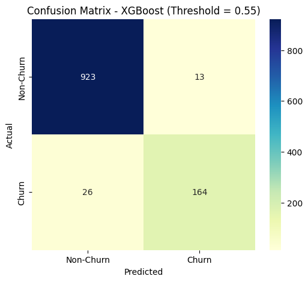
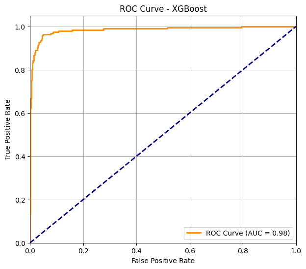

# 🛒 Ecommerce Customer Churn Prediction

This project involves analyzing customer churn behavior in an e-commerce dataset. It includes exploratory data analysis (EDA), preprocessing, model building using **XGBoost** and other classifiers, and evaluation using various performance metrics and visualizations.

---

## 📌 Objective

The goal is to **predict customer churn** based on behavioral, transactional, and demographic data. Churn is defined as whether a customer has stopped engaging with the platform.

---

## 📁 Dataset Description

Features include:

- `gender`, `marital_status`, `city_tier`, `preferred_payment_mode`, `preferred_login_device`
- Behavioral: `hours_spent_on_app`, `order_count`, `number_of_complaints`, `coupon_used`
- Target: `churn` (1 = churned, 0 = not churned)

---

## 🔍 Exploratory Data Analysis (EDA)

### General Insights

- Majority of users use **mobile phones** for login.
- **Debit cards** are the most used payment method.
- **More males than females** in the dataset.
- Most users are **married**.
- Most purchased categories: **Laptop & Accessories**, **Mobile Phones**.

### Churned Users Profile

- 🔺 **50.6%** of churned users are **single**.
- 🔺 Churn rate is highest in **Tier 1 cities** (56.1%), followed by Tier 3 (38.8%).
- 🔺 Users logging in with **multiple devices** are more likely to churn.
- 🔻 High **satisfaction scores (3+)** account for 78% of churned users.
- 🔻 Low **cashback amount** and **recent orders** are linked to churn.
- 🔺 **Fewer coupons used** and **lower order counts** → more churn.

### Correlation Matrix Highlights

- `tenure` ⬇ → `churn` ⬆ (negative correlation)
- `order_count` is correlated with `coupon_used` and `day_since_last_order`.
- `cashback_amount` is positively correlated with `tenure`.

---

## ⚙️ Data Preprocessing

- Handled Missing Values
- Removed/treated outliers in numerical columns.
- One-hot encoding of categorical features.
- Splitting into train-validation-test sets.
- Used **SMOTE** for resampling to address class imbalance.

---

## 🤖 Model: XGBoost Classifier

- Custom `scale_pos_weight` to balance classes.
- Threshold set to **0.55** (tuned for precision-recall balance).

```python
xgb_model = XGBClassifier(
    use_label_encoder=False,
    eval_metric='logloss',
    random_state=42
)
```

---

## 📊 Evaluation Metrics

### 1. XGBoost (Threshold=0.55)

- **Accuracy**: 0.97  
- **Precision**: 0.93 
- **Recall**: 0.86
- **F1-Score**: 0.89
- **AUC**: 0.9836

### 2. Logistic Regression (Threshold=0.55)

| Metric      | Score (Test) |
|-------------|--------------|
| Accuracy    | 0.89         |
| Precision   | 0.70         |
| Recall      | 0.61         |
| F1-score    | 0.65         |
| AUC         | 0.8891       |

### 3. Random Forest (Threshold=0.35)

| Metric      | Score (Test) |
|-------------|--------------|
| Accuracy    | 0.96         |
| Precision   | 0.87         |
| Recall      | 0.87         |
| F1-score    | 0.87         |
| AUC         | 0.9849       |

### 4. SVM (Threshold=0.35)

| Metric      | Score (Test) |
|-------------|--------------|
| Accuracy    | 0.89         |
| Precision   | 0.69         |
| Recall      | 0.68         |
| F1-score    | 0.68         |
| AUC         | 0.8899       |

### 5. KNN (Threshold=0.35)

| Metric      | Score (Test) |
|-------------|--------------|
| Accuracy    | 0.87         |
| Precision   | 0.58         |
| Recall      | 0.77         |
| F1-score    | 0.66         |
| AUC         | 0.9189       |

### 6. Decision Tree (Threshold=0.35)

| Metric      | Score (Test) |
|-------------|--------------|
| Accuracy    | 0.94         |
| Precision   | 0.80         |
| Recall      | 0.83         |
| F1-score    | 0.81         |
| AUC         | 0.8919       |


---

## 📷 Classification Report

- **Confusion Matrix** (Threshold 0.55)

    - This matrix shows the true positives, false positives, true negatives, and false negatives for Xg Boost.

    
    
- **ROC-AUC Curve** for all XGBoost Model

    

---

## 🚀 How to Run

```bash
# Install dependencies
pip install -r requirements.txt

# Or manually
pip install pandas numpy matplotlib seaborn scikit-learn xgboost imbalanced-learn

# Run the notebook
jupyter notebook EcommerceChurn.ipynb
```

---

## 🧠 Key Takeaways

- **Users with low tenure** and **low engagement** are more prone to churn.
- **Single, male users** in **Tier-1 cities** are most likely to churn.
- **High satisfaction scores** and **recent orders** help reduce churn.
- **Churn predictions** are highly influenced by factors such as order frequency, device usage, and payment methods.
